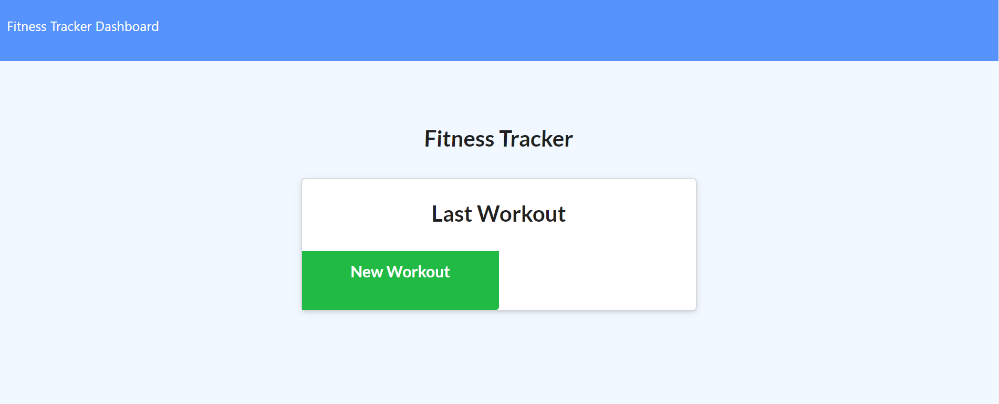
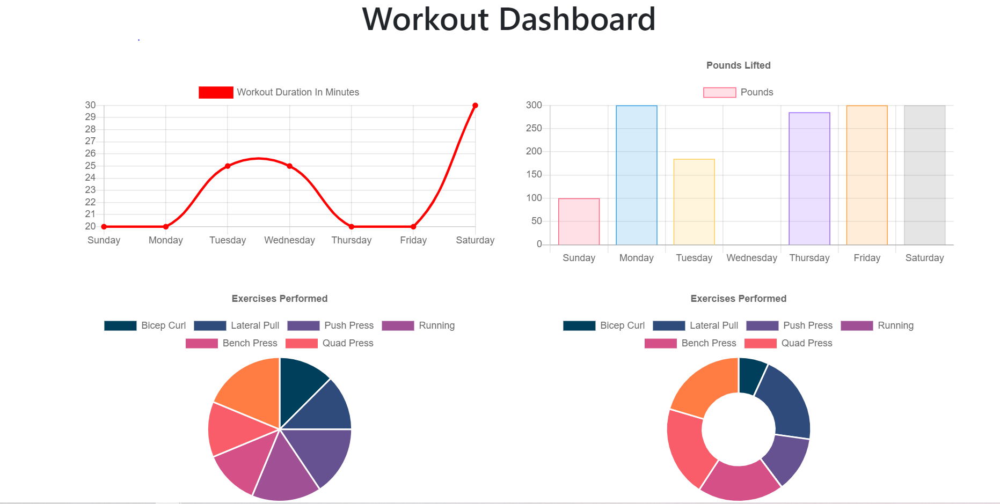
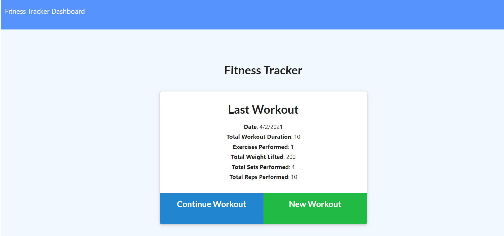

# fitness-tracker

## Goal:
Create an app to track your work out throughout the week.

## how it works:

1. On the hompage you can start a new woek out or continue an existing one.
2. when you enter a new exercise you have to options to choose, Cardio or Resistence.
3. in each of them you can complette all the details of the workout.
4. When you complete a workout you will be redirected to the home page with the derails of your last workout.
5. On your dashboard page you can see your stats for the past 7 day with graphs.

##Screenshots:

##Links:

GitHub Ripo:
https://github.com/zpinson/fitness-tracker
Deployed link:
https://fitnesstrakerzp.herokuapp.com/